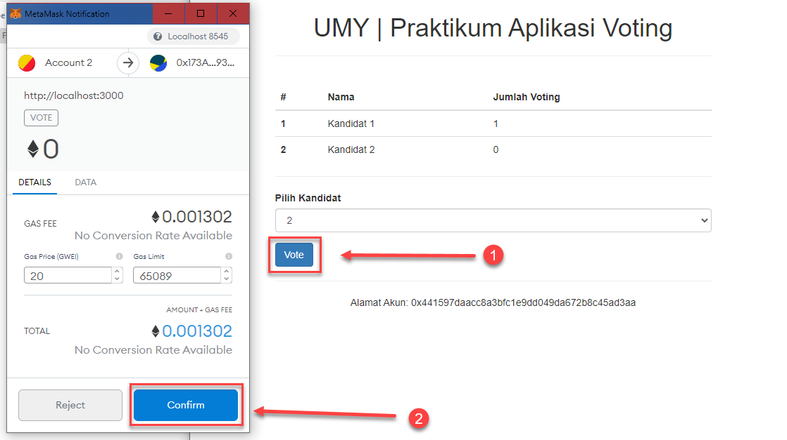

<!-- PROJECT LOGO -->
<p align="center">
  <h1 align="center">Aplikasi Voting - Ethereum Blockchain</h1>

  <p align="center">
    Aplikasi Voting sederhana menggunakan Ethereum Blockchain.
  </p>
</p>


<!-- TABLE OF CONTENTS -->
<details open="open">
  <summary>Daftar Isi</summary>
  <ol>
    <li>
      <a href="#tentang-projek">Tentang Projek</a>
    </li>
    <li>
      <a href="#untuk-memulai">Untuk Memulai</a>
      <ul>
        <li><a href="#perangkat-lunak">Perangkat Lunak</a></li>
        <li><a href="#instalasi">Instalasi</a></li>
      </ul>
    </li>
    <li><a href="#penggunaan">Penggunaan</a></li>
    <li><a href="#kontak">Kontak</a></li>
    <li><a href="#acknowledgements">Acknowledgements</a></li>
  </ol>
</details>


<!-- ABOUT THE PROJECT -->
## Tentang Projek
Salah satu aplikasi pada praktikum Aplikasi pada buku pengantar teknologi blockchain: aplikasi terdistribusi. Aplikasi sederhana ini dapat menyimpan data kandidat dan pemilih pada sistem voting sederhana menggunakan Ethereum Blockchain.


<!-- GETTING STARTED -->
## Untuk Memulai

Untuk dapat menjalankan Aplikasi ini pada komputer Anda, diperlukan beberapa perangkat lunak serta langkah instalasinya sebagai berikut:

### Perangkat Lunak

Pada saat pembuatan aplikasi ini, digunakan beberapa perangkat lunak dengan spesifikasi sebagai berikut:
-	Nodejs versi v12.16.3 
-	Npm versi 7.15.1
-	Truffle Framework versi v5.1.45,
-	Ganache sebagai Lokal Ethereum Blockchain,
-	Ethereum wallet seperti metamask.


### Instalasi

1. Download / Clone kode aplikasi projek ini,
   ```sh
   git clone https://github.com/kangPrayit/blockchain-aplikasi-voting.git
   ```
3. Install package yang dibutuhkan oleh aplikasi dengan menggunakan perintah:
   ```sh
   npm install
   ```
4. Jalankan aplikasi Ganache
5. Migrasi Smart Contract ke lokal Ethereum Blockchain:
   ```JS
   truffle migrate
   ```
6. Jalankan aplikasi menggunakan perintah:
   ```JS
   npm run dev
   ```


<!-- USAGE EXAMPLES -->
## Penggunaan
Beberapa langkah penggunaan seperti
- Pilih kandidat yang akan Anda pilih.


- Setelah pilihan kandidat dipilih, tekan tombol Vote.


- Akan muncul konfirmasi transaksi dari wallet metamask, pilih confirm.


- Setelah konfirmasi disetujui maka data pilihan kita akan direkam oleh Ethereum Blockchain.


<!-- CONTACT -->
## Kontak

Prayitno - [@kang_prayit](https://twitter.com/kang_prayit)

Project Link: [https://github.com/kangPrayit/blockchain-aplikasi-voting](https://github.com/kangPrayit/blockchain-aplikasi-voting)


<!-- ACKNOWLEDGEMENTS -->
## Acknowledgements
* Eko Prasetyo
* Sunardi
